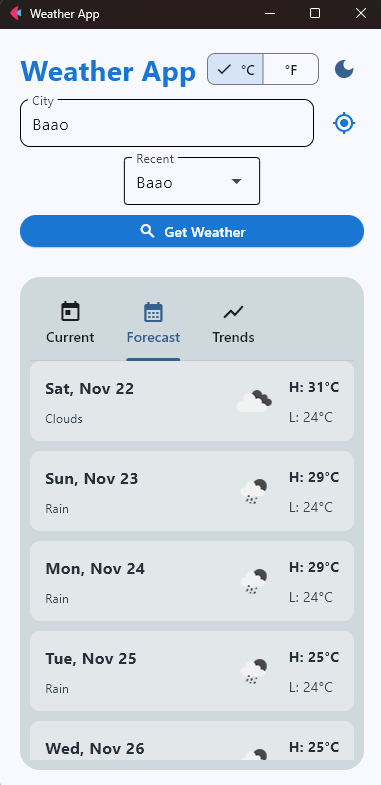
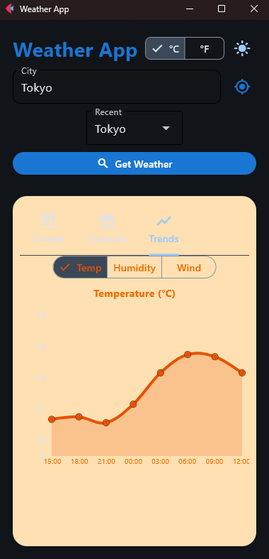
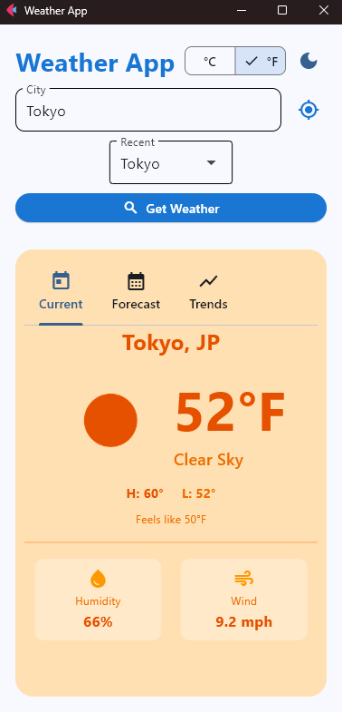

# Weather Application - Module 6 Lab

## Student Information
- **Name**: John Renzzo C. Montenegro
- **Student ID**: 231002278
- **Course**: CCCS 106
- **Section**: BSCS - 3A

## Project Overview
This weather app fetches and displays a user input address' current weather forecast, humidity level, and wind flow speed.

## Features Implemented

### Base Features
- [x] City search functionality
- [x] Current weather display
- [x] Temperature, humidity, wind speed
- [x] Weather icons
- [x] Error handling
- [x] Modern UI with Material Design

### Enhanced Features
1. **Search History**
   - Stores the last 5 - 10 searched cities.
   - This feature allows users to quickly access previously searched locations to avoid retyping them.
   - The json file was all over the place when it was first instantiated. Adjusted the main.py file path to read it inside the mod6_labs folder.

2. **Temperature Unit Toggle**
   - Toggles between Celsius / Fahrenheit.
   - This feature allows users to know the exact temperature of the entered location based on the unit they are used to without much hassle.
   - Mislabeled values every conversion. Made own function to not ruin the logic of the display function.

3. **Weather Condition Icons and Colors**
   - Changes background colors based on the weather forecast.
   - This feature makes it visually easier to determine the weather forecast without reading too much data on the screen.
   - Color doesn't change. Forced redraw theme to apply new colors.

4. **Current Location Weather**
   - Detects current location of the user via IP-based geolocation.
   - This features allow the users to know the forecast of their current location without the hassle of typing their current address.
   - No dedicated button to detect user's current location. Used httpx to fetch ipapi data to provide the user's current location.

5. **5-Day Weather Forecast**
   - Displays weather forecast for the next five days on the desired location.
   - This features allows weather predictability and preparedness for its users.
   - The icons were not showing up. Used color=theme["icon"] to ensure visibility even when themes are toggled.

6. **Weather Charts and Graphs**
   - Displays the current location's Temperature, Humidity, and Wind Speed in a graph form.
   - This feature visually allows the user to record the data of the past and current forecast to summarize complex data.
   - The texts were upside down. Moved title out of the chart axis to avoid text from flipping again.

## Screenshots





## Installation

### Prerequisites
- Python 3.8 or higher
- pip package manager

### Setup Instructions
```bash
# Clone the repository
git clone https://github.com/johmontenegro-cell/cccs106-projects.git
cd cccs106-projects/mod6_labs

# Create virtual environment
python -m venv venv
source venv/bin/activate  # On Windows: venv\Scripts\activate

# Install dependencies
pip install -r requirements.txt

# Create .env file
cp .env.example .env
# Add your OpenWeatherMap API key to .env